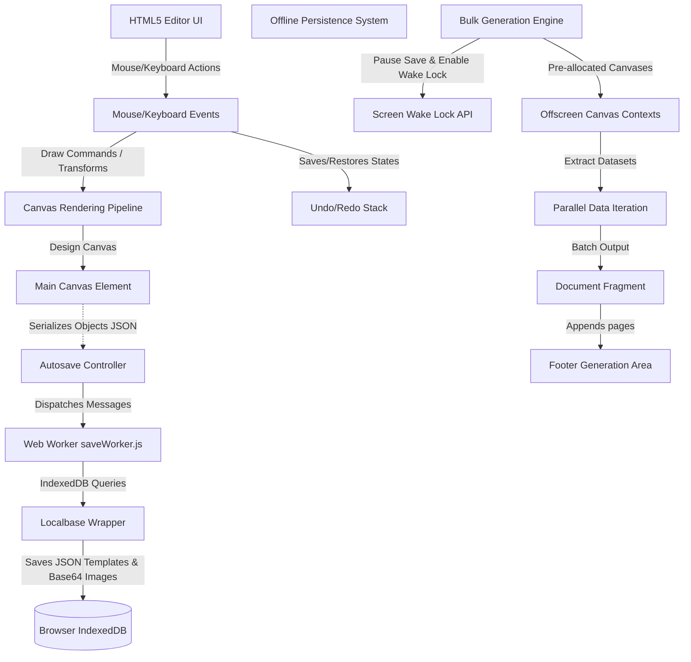

# Iterator

[](#)
[](#)

A high-performance, offline-first vector graphic editor and bulk rendering engine designed for dynamic ID card, badge, and document template generation. 

---

## Table of Contents

- [Overview](#overview)
- [Key Features](#key-features)
- [System Architecture](#system-architecture)
- [Technical Highlights & Engineering Challenges](#technical-highlights--engineering-challenges)
- [Project Structure](#project-structure)
- [Technologies Used](#technologies-used)
- [Installation](#installation)
- [Usage Guide](#usage-guide)
- [Development & Extending the Project](#development--extending-the-project)
- [Future Improvements](#future-improvements)
- [License](#license)

---

## Overview

**Iterator** is a sophisticated browser-based vector layout editor built to solve the challenge of mass-producing customized print assets—such as student ID cards, corporate badges, certificates, and name tags. 

Traditional layout design tools (like Illustrator or Figma) lack native, zero-code bulk iteration interfaces, while programmatic rendering tools (like LaTeX or headless HTML-to-PDF APIs) lack interactive WYSIWYG designers. **Iterator** bridges this gap.

### The Problem It Solves
When organizations need to generate hundreds of customized ID badges, designers are forced to either copy-paste template details manually or coordinate with developers to write scripts. Iterator provides an intuitive canvas editor where users can design their layout, import datasets, set layout behaviors, and generate high-resolution print files locally in seconds.

### Target Audience
* **Organizations & Schools**: Bulk generating IDs or event passes.
* **Graphic Designers**: Creating customized print templates without coding.
* **Event Coordinators**: Fast production of badges from CSV-like text blocks.

---

## Key Features

### 1. Vector Design Canvas
* **Multi-Shape Drawing**: Full vector path support for Rectangles, Ellipses, Polygons, Lines, and Text boxes.
* **Camera Controls**: Panning (Grab cursor), Zooming (pinch, scroll wheel, and clicking-and-holding zoom hotkeys), and **Fit-to-Page** view centering.
* **Z-Index depth sorting**: Complete layering controls (Bring to Front, Send to Back, Page Up, Page Down).
* **Transform Matrices**: Standard canvas rotate, scale, translate, and multi-axis flipping.
* **Group & Ungroup**: Compound group hierarchies that scale and rotate relative to group centers.
* **Dynamic Grid Snapping**: Real-time cursor snapping aligning shape bounds to coordinates of other shapes on the canvas.

### 2. Multi-Format Asset Iteration
* **Dynamic Text Handling**: Input lists of text data (separated by newlines) to iterate fields (e.g., Names, Titles, ID numbers). Features real-time text iteration preview directly on the canvas as you type.
* **Text Alignments**: Horizontal (`Left`, `Center`, `Right`) and Vertical (`Top`, `Center`, `Bottom`) iterate alignment overrides to mathematically adjust coordinates as dynamic text lengths update.
* **Text Overflow Strategies**: 
  * `Fit`: Scale font size dynamically to fill the bounds of the original box.
  * `Shrink to Fit`: Scale down text *only if* it exceeds the original box width (relative to initial text width).
  * `Create New Line` & `At White Space`: Character wrapping or word-boundary wrapping.
* **Dynamic Image Handling**: Batch upload images mapped to dataset sequences, uploading files in parallel chunks of 10.
* **Image Scaling Modes**: Proportional aspect ratio preservation under `Maintain Height` (adapts width based on aspect ratio) and `Maintain Width` (adapts height based on aspect ratio).
* **Image Alignments**: Horizontal (`Left`, `Center`, `Right`) and Vertical (`Top`, `Center`, `Bottom`) alignment configurations to mathematically position dynamic images relative to their design boxes.

### 3. Masking & Vector Clipping
* **Clipping Masks (Clipping Tool)**: Bind any vector object (images, text, shapes) inside a parent container.
* **Visual Nesting**: Employs 2D Canvas clipping regions (`ctx.clip()`) to crop background elements inside custom curves.
* **Independent Child Transformation**: Edit clipped objects' dimensions and rotation coordinates inside the clip mask path.

### 4. Advanced Printing & Layout Options
* **Preset Document Sizes**: Match industry standards like A1–A6, Letter, Legal, and Business Card dimensions.
* **Multi-Card Grid Layouts**: Print a single card per page or automatically group cards in custom rows, columns, and spacing intervals.
* **High-Resolution Exports**: Custom rendering scales (e.g., 2x, 3x) to match print requirements.
* **Anti-Crash PDF Generation**: Interactive settings modal overlay allowing users to stage PDF downloads (custom page limit per document, supporting 1 to 500 pages) to prevent browser memory crashes.
* **Custom Image Formats**: Choose between high-quality transparency PNG files or compressed, smaller JPEG files directly upon clicking download.

### 5. Desktop-Grade UX (Figma-Like Shortcuts)
* **Keyboard Hotkeys**: Nudging coordinates (arrow keys), quick duplicating (`Ctrl + D`), full page zooms (`Shift + @`), undo/redo (`Ctrl + Z` / `Ctrl + Y`), alignment commands (`L`/`C`/`R`/`T`/`E`/`B`), and tool switching.
* **Storage Dashboard**: Integration with the browser's Storage Manager API to track database usage and persist offline storage.

---

## System Architecture

The application is structured around a central HTML5 Canvas rendering loop, backed by an offline-first storage architecture utilizing Web Workers and IndexedDB.



### Core Architecture Components
1. **Object Hierarchy (`src/models/`)**: Every canvas object is a class extending the base `Formats` class, containing modular overrides for rendering, bounding box calculation, double-click editing, duplication, property bindings, and data iteration.
2. **Offline-First Persistence**: Custom font files and graphic components are converted to Base64 URLs and stored in IndexedDB. Layout templates are serialized to JSON.
3. **Multi-threaded Data Processing**: Project serialization, auto-saving, and asset garbage collection run inside `saveWorker.js` to ensure the editing UI remains uninterrupted at 60 FPS.

---

## Technical Highlights & Engineering Challenges

### 1. High-Performance Bulk Rendering Pipeline
The generation loop maps datasets dynamically to custom canvas elements. If not optimized, canvas resizing and DOM appending trigger garbage collection (GC) pauses and browser reflows:
```javascript
// Optimized pre-allocation in generate.js
const totalPages = renderPage === "auto" ? iterationLength : Math.ceil(iterationLength / boxesPerPage);
const pageCanvases = Array.from({ length: totalPages }, () => {
  const { pc, ptx } = createPageCanvas();
  fragment.append(pc); // Batch append via DocumentFragment
  return { pc, ptx };
});
```
* **OffscreenCanvas**: Utilizes `OffscreenCanvas` contexts (where supported) to process canvas operations in separate threads.
* **Thread Yielding**: The engine uses non-blocking asynchronous intervals (`setTimeout(resolve, 0)`) to yield the thread to the browser paint cycle every 16ms, ensuring the browser remains responsive.
* **Batch DOM Insertion**: Renders all cards to document fragments off-DOM, performing a single DOM write at the end of the process.

### 2. Multi-Threaded Asset Syncing & DB Garbage Collection
Images are stored separately from JSON layout files to keep documents lightweight. However, deleting images from templates leaves orphan assets in IndexedDB.
* **Web Worker Asset Garbage Collection**: `saveWorker.js` runs a background verification comparing stored assets with reference hashes. It automatically purges unused binary strings from the database:
```javascript
// saveWorker.js garbage collection routine
async function deleteUnusedImage() {
  const allImageFile = await db.collection(`img${formerName}`).get();
  if (drawingImage !== null) return;
  const imagesInSet = new Set();
  images.forEach(img => {
    img.originalFiles?.forEach(file => { imagesInSet.add(file); });
  });
  const toDeleteIds = allImageFile.filter(doc => !imagesInSet.has(doc.id)).map(doc => doc.id);
  for (const id of toDeleteIds) {
    await db.collection(`img${formerName}`).doc({ id }).delete();
  }
}
```

### 3. Anti-Crash Memory Management & VRAM Safety (High-Efficiency Rendering)
Generating highly detailed multi-page PDFs and rendering hundreds of cards can cause browser tabs to exceed graphics memory limits and crash:
* **Single Canvas Reuse during Exports**: Rather than instantiating hundreds of new canvas elements inside the PDF/Image download loop (which causes a massive VRAM spike), the exporters instantiate **exactly one** offscreen canvas and context, clear it using `clearRect()`, and draw over it repeatedly. This cuts VRAM allocation by 99% during exports.
* **Canvas GPU Memory Disposal**: Before removing obsolete cards from the DOM during batch pagination changes, all rendered canvas children are resized to `0px * 0px`. This forces the browser to discard their GPU texture backing-stores immediately rather than waiting on delayed garbage collection.
* **Texture Cache spacer GIF Cleanups**: When dynamic image properties are overridden or deleted during iterations, the obsolete image element's `src` is temporarily set to a 1px transparent spacer GIF. This signals the browser to instantly drop its decoded texture cache from graphics memory.
* **Static HTML Progress Indicators**: The Loader progress overlay is constructed as static HTML nodes, updated directly via lightweight JavaScript properties (`style.width` and `textContent`). This completely eliminates heavy, recurring `innerHTML` string parsing and DOM reconstruction overhead.
* **Chunked Staged Exports**: The app auto-paginates staged PDF documents into sequences (`projectname-1.pdf`, `projectname-2.pdf`) based on user-configured page limits (customizable from 1 to 500 pages) to keep exports lightweight and safe.

### 4. Screen Wake Lock Integration
Generating bulk assets (e.g., 500 badges) takes time. If the system goes to sleep mid-generation, rendering is interrupted.
* **Wake Lock Control**: Integrating `navigator.wakeLock`, the engine locks the screen wake status at the start of generation and releases it only after the export is complete.

---

## Project Structure

```bash
Iterator/
├── index.html            # Main home page (dashboard, template selection, JSON upload)
├── project.html          # Vector Canvas WYSIWYG editor interface
├── preferences.html      # IndexedDB space statistics and custom Font manager
├── contact.html          # Support and feedback form
├── help.html             # Interactive reference document (tools & hotkeys)
├── script.js             # Controller for project creation, loading, and importing
├── project.js            # Main controller bootstrapping mouse/keyboard events on canvas
├── preferences.js        # Controller tracking storage allocations & font imports
├── saveWorker.js         # Web Worker handling asynchronous autosaves & DB cleanups
├── style.css             # Base styles for home dashboard
├── src/
│   ├── constants.js      # Global layout dimensions and DOM element selections
│   ├── variable.js       # Shared state parameters (selected objects, mouse positions)
│   ├── Tools/
│   │   ├── tools.js      # Main editor tool selector (Move, Pan, Add shape, Draw)
│   │   ├── pageTo.js     # Z-index layout layering operations
│   │   └── others.js     # Alignments, groups, and bounding zoom calculations
│   ├── models/
│   │   ├── formats.js    # Base class wrapping fills, gradients, outlines, and snaps
│   │   ├── text.js       # TextBox component supporting inline typing & font imports
│   │   ├── images.js     # Images controller with aspect ratio locks and iterations
│   │   ├── rectangle.js  # Rectangle shape with bevel, rounded corner, and path conversion
│   │   ├── ellipse.js    # Ellipse shape logic
│   │   ├── polygon.js    # Multi-sided polygon drawer
│   │   ├── line.js       # Spline drawing and control point coordinates
│   │   ├── guide.js      # Vertical & horizontal snaps alignment lines
│   │   └── loader.js     # Graphic loading progress bar
│   ├── state/
│   │   ├── canvas.js     # Handles canvas viewport scales and orientations
│   │   ├── save.js       # JSON serializers/deserializers for local saving
│   │   ├── exportSave.js # Orchestrator for PDF batching and PNG export zip triggers
│   │   └── undo.js       # Memento-based undo/redo stacks
│   └── utils/
│       ├── mouseEvents.js # Mouse and touch touchstart/move gesture routers
│       ├── convert.js    # Math utility converters (deg/rad, hex/rgb, measurement ratios)
│       ├── draw.js       # Single frame rendering request scheduler
│       ├── uiHelpers.js  # Notifications and generate panel layout updates
│       └── screenWake.js # Navigator Screen Wake Lock handler
```

---

## Technologies Used

* **Core Language**: Native Vanilla JavaScript (ES6 Modules)
* **Structure & UI**: HTML5, Semantic CSS3
* **Local Database**: IndexedDB (using [Localbase](https://github.com/dannyconnell/localbase) wrapper)
* **Export Engines**: 
  * [jsPDF](https://github.com/parallax/jsPDF) (Client-side PDF generation)
  * [html2canvas](https://github.com/niklasvh/html2canvas) (Canvas representation conversion)
  * [JSZip](https://github.com/Stuk/jszip) (Bundling batch images)
* **APIs**:
  * Screen Wake Lock API (keeps devices active during print exports)
  * Storage Manager API (local memory quota telemetry)
  * Web Worker API (off-thread DB syncing)

---

## Installation

### Prerequisites
Make sure you have Node.js and npm installed on your system to download the vendor packages.

### Setup Instructions
1. Clone the repository to your local directory:
   ```bash
   git clone https://github.com/your-username/Iterator.git
   cd Iterator
   ```
2. Install the vendor libraries:
   ```bash
   npm install
   ```
3. Run the application locally. Since the project utilizes Web Workers and ES6 Modules, you must run it through a local server to avoid CORS issues:
   * **Using VS Code**: Install the **Live Server** extension and click **Go Live**.
   * **Using Node/npx**: Run:
     ```bash
     npx serve ./
     ```
4. Open the displayed local address (usually `http://localhost:3000` or `http://localhost:5500`) in your web browser.

---

## Usage Guide

### 1. Creating a Template
1. On the dashboard page, click **New Project** and name your file.
2. Select your document target size (e.g., A4, Business Card, Letter) or input a custom width and height.
3. Draw layout guides by selecting the Ruler/Guide tool to set boundary markers.
4. Draw structural shapes (Rectangles, Ellipses) to form your cards' card slots. Use the **Outline** and **Fill** tabs (Uniform, Linear, or Radial Gradient) in the Properties Panel to style them.

### 2. Setting Up Dynamic Datasets
1. **Adding Names/Titles**: Click **Add Textbox** and draw a boundary. In the properties panel, toggle **Iterate** and input your text sequence into the multiline text area (one line per record).
2. Choose your overflow styling mode (e.g., `Shrink to Fit` to avoid name clippings).
3. **Adding Photos**: Click **Add Image** and select a baseline file. In the properties panel, click **Add Images** to upload additional files. They will align sequentially with the text lines.

### 3. Grouping and Nesting Elements
* To clip a face photo inside a circular ellipse:
  1. Select the photo layer.
  2. Click the **Clip Tool** (paperclip icon).
  3. Click the circle shape you want to mask it inside.
  4. The photo will crop into a circle. Adjust photo sizing independently using properties.

### 4. Bulk Generation & Printing
1. Click **Generate** in the top navigation bar.
2. Select the target layout grid (e.g., how many cards fit per column/row of print paper).
3. Click **Done**. The engine renders your cards to canvas blocks.
4. Click **Save as PDF** or **Save as Image** to download.

---

## Development & Extending the Project

### Adding a New Shape Class
To introduce a new vector shape (e.g., a Star or Starburst):
1. Create a file inside `src/models/star.js` extending the `Formats` base class:
   ```javascript
   import Formats from "./formats.js";
   
   export default class Star extends Formats {
     constructor(x, y, rays, outerRadius, innerRadius) {
       super();
       this.type = "star";
       // custom properties
     }
     
     addObject() {
       ctx.save();
       // custom rendering operations...
       ctx.restore();
     }
   }
   ```
2. Add the revival switch statement in `src/state/save.js` inside `reviveObjects()`:
   ```javascript
   case "star":
     instance = new Star();
     break;
   ```
3. Add a tool activation case inside `src/Tools/tools.js` to trigger star creation on mouse coordinate clicks.

---

## Future Improvements

* **Native Boolean Part Operations**: Support Boolean operations (**Weld/Union**, **Trim/Subtract**, **Intersect**, and **Exclude**) on vector parts to build complex compound geometries.
* **CSV Data Imports**: Add native support for loading external data files (.csv, .xlsx) to map text labels directly to template coordinates.
* **WebRTC Templates Sharing**: Fast peer-to-peer templates transmission without database uploads.
* **Batch Background Thread Rendering**: Move the main canvas drawing loop to an offscreen thread using OffscreenCanvas workers, avoiding main thread rendering entirely.
* **Inline Rich Text Styling**: Allow users to highlight specific parts of text boxes to apply custom formatting (bold, italic, color, size) dynamically on canvas text layers.

---

## License

All rights reserved. Proprietary and confidential.
